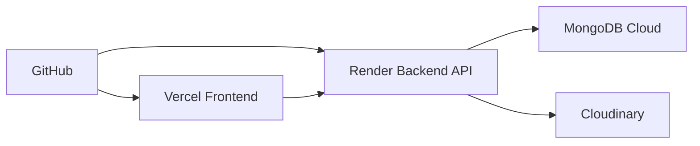

# Gym Tracker Web

Aplicacion web para registrar rutinas de gimnasio, consultar historial de entrenamientos y seguir el progreso de fuerza, repeticiones y fotos de avance desde movil o escritorio.

## Estado Actual

Este repositorio todavia no contiene la implementacion de la app. Por ahora incluye:

- La especificacion funcional del proyecto.
- Los datos de ejemplo en `Rutina.txt`.
- La arquitectura objetivo para desarrollo y produccion.

## Objetivo Del Proyecto

Transformar las notas manuales de `Rutina.txt` en una app web con estas capacidades:

- Crear, editar y eliminar rutinas.
- Consultar historial por fecha y tipo de entrenamiento.
- Registrar ejercicios, series, peso, repeticiones y notas.
- Ver progreso por ejercicio.
- Subir fotos de progreso fisico.
- Tener persistencia en la nube y despliegue real en produccion.

## Datos De Ejemplo

`Rutina.txt` se usara como semilla inicial de desarrollo y prueba. El archivo contiene 9 entrenamientos reales con tres tipos principales:

- `Piernas`
- `Torso`
- `Full`

Tambien incluye casos que la app debe soportar correctamente:

- Pesos enteros: `55`, `113`, `122`
- Pesos decimales: `40.5`, `40.8`, `31.7`
- Etiquetas manuales de peso: `2+`, `31++`, `31+++`
- Notas por serie: `asistida`, `spot`
- Nombres similares del mismo grupo o ejercicio: `Isquio` e `Isquiotibiales`, `Extensiones` y `Extension codo`

### Ejemplo Normalizado A Partir De `Rutina.txt`

Ejemplo basado en la sesion `28/10 - Torso`:

```json
{
  "fechaTexto": "28/10",
  "tipo": "Torso",
  "ejercicios": [
    {
      "nombre": "Press inclinado",
      "series": [
        { "pesoEtiqueta": "25", "pesoValor": 25, "repeticiones": 8, "nota": null },
        { "pesoEtiqueta": "25", "pesoValor": 25, "repeticiones": 9, "nota": "asistida" },
        { "pesoEtiqueta": "25", "pesoValor": 25, "repeticiones": 6, "nota": null }
      ]
    },
    {
      "nombre": "Polea pecho",
      "series": [
        { "pesoEtiqueta": "45", "pesoValor": 45, "repeticiones": 12, "nota": null },
        { "pesoEtiqueta": "45", "pesoValor": 45, "repeticiones": 11, "nota": null },
        { "pesoEtiqueta": "45", "pesoValor": 45, "repeticiones": 10, "nota": null }
      ]
    },
    {
      "nombre": "Apertura",
      "series": [
        { "pesoEtiqueta": "40", "pesoValor": 40, "repeticiones": 6, "nota": null },
        { "pesoEtiqueta": "31++", "pesoValor": 31, "repeticiones": 8, "nota": null },
        { "pesoEtiqueta": "31++", "pesoValor": 31, "repeticiones": 7, "nota": null }
      ]
    }
  ]
}
```

## Propuesta De Producto

La app debe enfocarse en una experiencia simple y rapida para registrar entrenamientos.

### MVP

- Login y registro de usuario.
- Dashboard con resumen de las ultimas rutinas.
- CRUD completo de rutinas.
- Filtro por tipo: `Torso`, `Piernas`, `Full`.
- Vista detalle por rutina.
- Historial por ejercicio.
- Carga de fotos de progreso.
- Seed inicial importando datos desde `Rutina.txt`.

### Funciones Recomendadas Para Una Segunda Etapa

- Graficos de progresion por ejercicio.
- Comparativa semanal o mensual.
- Plantillas de rutina reutilizables.
- Etiquetas musculares por ejercicio.
- Recordatorios o agenda de entrenamiento.

## Stack De Produccion

Las herramientas obligatorias de produccion para este proyecto son las siguientes:

| Capa | Herramienta | Uso |
| --- | --- | --- |
| Repositorio y control de versiones | GitHub | Codigo fuente, pull requests, issues y CI/CD |
| Frontend web | Vercel | Despliegue de la interfaz web |
| Backend API | Render | Despliegue de la API y procesos del servidor |
| Base de datos | MongoDB Cloud | Persistencia de usuarios, rutinas y fotos |
| Almacenamiento de imagenes | Cloudinary | Fotos de progreso y recursos multimedia |

### Stack Tecnico Recomendado

- Frontend: Next.js + React + Tailwind CSS
- Backend: Node.js + Express
- Base de datos: MongoDB Cloud con Mongoose
- Autenticacion: JWT con cookies seguras o sesiones
- Media: Cloudinary con subidas firmadas desde backend

## Arquitectura Objetivo



### Responsabilidad Por Servicio

- Vercel sirve la app web, rutas del frontend y variables publicas.
- Render expone la API REST, valida datos, autentica usuarios y firma subidas.
- MongoDB Cloud guarda rutinas, ejercicios, series, usuarios y metadatos de imagenes.
- Cloudinary almacena fotos de progreso y devuelve URLs optimizadas.
- GitHub centraliza el codigo y el flujo de despliegue.

## Modelo De Datos

### Entidades Principales

#### Usuario

```ts
interface User {
  id: string;
  name: string;
  email: string;
  passwordHash: string;
  createdAt: string;
}
```

#### Rutina

```ts
interface Workout {
  id: string;
  userId: string;
  fecha: string;
  fechaTextoOriginal?: string;
  tipo: 'Torso' | 'Piernas' | 'Full';
  ejercicios: Exercise[];
  notasGenerales?: string;
  fotos?: ProgressPhoto[];
  createdAt: string;
  updatedAt: string;
}
```

#### Ejercicio

```ts
interface Exercise {
  nombre: string;
  grupoMuscular?: string;
  series: WorkoutSet[];
}
```

#### Serie

```ts
interface WorkoutSet {
  pesoEtiqueta: string;
  pesoValor?: number;
  repeticiones: number;
  nota?: string;
}
```

#### Foto De Progreso

```ts
interface ProgressPhoto {
  url: string;
  publicId: string;
  takenAt: string;
  etiqueta?: string;
}
```

### Decisiones Importantes Del Modelo

- `pesoEtiqueta` conserva el valor exacto introducido por el usuario, por ejemplo `31++`.
- `pesoValor` permite ordenar, filtrar o graficar cuando existe un numero usable.
- `fechaTextoOriginal` sirve para mantener trazabilidad si se importan datos desde texto plano.
- Las fotos no se guardan en MongoDB Cloud como binario; solo se guardan URLs y metadatos de Cloudinary.

## Flujo De Importacion De `Rutina.txt`

La importacion inicial debe seguir esta logica:

1. Detectar una fecha en formato `dd/mm`.
2. Leer la siguiente linea como tipo de rutina.
3. Detectar cada nombre de ejercicio hasta encontrar las series.
4. Parsear cada serie en formato `peso repeticiones` o `peso repeticiones nota`.
5. Normalizar pesos numericos y conservar la etiqueta original.
6. Guardar el resultado como documento en MongoDB Cloud.

### Casos Que El Parser Debe Soportar

- `25 9 asistida`
- `35 7 spot`
- `31++ 8`
- `40.8 10`
- Variaciones de nombres con tildes o sin tildes

## API Sugerida

### Autenticacion

- `POST /api/auth/register`
- `POST /api/auth/login`
- `POST /api/auth/logout`
- `GET /api/auth/me`

### Rutinas

- `GET /api/workouts`
- `GET /api/workouts/:id`
- `POST /api/workouts`
- `PATCH /api/workouts/:id`
- `DELETE /api/workouts/:id`

### Fotos

- `POST /api/uploads/signature`
- `POST /api/progress-photos`
- `DELETE /api/progress-photos/:id`

## Estructura Objetivo Del Repositorio

```text
Gym/
  apps/
    web/          # Next.js desplegado en Vercel
    api/          # Node.js + Express desplegado en Render
  packages/
    shared/       # tipos, validaciones y utilidades comunes
  scripts/
    import-rutina-txt/
  Rutina.txt
  readme.md
```

## Variables De Entorno

### Frontend En Vercel

```env
NEXT_PUBLIC_API_URL=https://tu-api.onrender.com
NEXT_PUBLIC_CLOUDINARY_CLOUD_NAME=tu-cloud-name
```

### Backend En Render

```env
PORT=10000
MONGODB_URI=mongodb+srv://...
JWT_SECRET=...
CLOUDINARY_CLOUD_NAME=...
CLOUDINARY_API_KEY=...
CLOUDINARY_API_SECRET=...
CLIENT_URL=https://tu-frontend.vercel.app
```

## Despliegue En Produccion

1. Subir el codigo a GitHub.
2. Conectar `apps/web` a Vercel.
3. Conectar `apps/api` a Render.
4. Crear cluster y usuario en MongoDB Cloud.
5. Configurar credenciales en Cloudinary.
6. Definir variables de entorno en Vercel y Render.
7. Habilitar CORS entre el frontend de Vercel y el backend de Render.
8. Ejecutar el script de importacion inicial usando `Rutina.txt`.

## Criterios Minimos De Aceptacion

- La app permite crear una rutina desde la web.
- Cada rutina guarda ejercicios y series en MongoDB Cloud.
- El usuario puede consultar historial por fecha y tipo.
- Las fotos de progreso se suben a Cloudinary y quedan asociadas al usuario.
- El frontend queda desplegado en Vercel.
- El backend queda desplegado en Render.
- El codigo fuente queda versionado en GitHub.

## Siguiente Paso Recomendado

La siguiente tarea natural para este repositorio es generar la base real del proyecto web con:

- `apps/web` en Next.js
- `apps/api` en Express
- conexion a MongoDB Cloud
- subida de imagenes a Cloudinary
- importador inicial desde `Rutina.txt`
